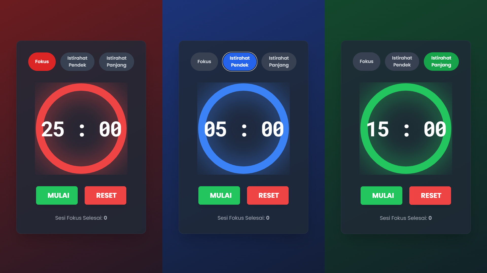

# 🍅 Tomaro

> A modern Pomodoro timer built with Alpine.js and TailwindCSS. Helps you focus today, so you can relax *tomorrow*.

Ini adalah aplikasi Pomodoro Timer yang ringan, *stylish*, dan fungsional yang dibuat murni di *front-end* menggunakan HTML, TailwindCSS, dan Alpine.js.

---

## 📸 Screenshot



*(Tip: Upload screenshot kamu (misal: `screenshot.png`) ke dalam folder repo ini, lalu ganti nama file di atas jika perlu).*

## 🚀 Live Demo

Coba `Tomaro` secara langsung di sini:

[**https://wayosu.github.io/tomaro/**](https://wayosu.github.io/tomaro/)

---

## ✨ Fitur Utama

* **UI Dinamis & Modern:** Tampilan *glassmorphism* keren dengan gradien latar belakang yang berubah warna secara halus (merah untuk fokus, biru/hijau untuk istirahat).
* **Timer yang Dapat Disesuaikan:** Atur durasi kustom kamu sendiri untuk mode Fokus, Istirahat Pendek, dan Istirahat Panjang melalui modal pengaturan.
* **Penyimpanan Lokal:** Pengaturan durasimu akan diingat! Semua disimpan di `localStorage` browser, jadi tidak hilang saat di-*refresh*.
* **Notifikasi Desktop & Suara:** Dapatkan peringatan notifikasi *native* dan suara "ding!" saat timer selesai (bahkan saat kamu sedang di *tab* lain).
* **Progress Bar Interaktif:** *Progress bar* lingkaran dengan efek "neon glow" yang memuaskan dan ikut berubah warna.
* **Timer di Judul Tab:** Pantau sisa waktu langsung dari judul *tab* browser kamu, bahkan saat sedang *multitasking*.
* **Tanpa *Build Step*:** Sangat ringan. Hanya 3 file (HTML, CSS, JS) tanpa perlu *compiler* atau *framework* berat.

## 🛠️ Tech Stack

Proyek ini dibangun menggunakan *stack* yang sangat ringan dan modern, berfokus pada penulisan langsung di HTML.

* 
* 
* 

## 💻 Cara Menjalankan

Kamu bisa menjalankan proyek ini secara lokal dengan beberapa langkah mudah.

1.  **Clone repositori ini:**
    ```bash
    git clone [https://github.com/wayosu/tomaro.git](https://github.com/wayosu/tomaro.git)
    ```

2.  **Masuk ke folder proyek:**
    ```bash
    cd tomaro
    ```

3.  **Jalankan dengan Live Server (Penting!):**
    * Kamu bisa langsung membuka file `index.html` di browser.
    * **TAPI:** Fitur **Notifikasi** tidak akan berfungsi jika dibuka langsung (`file:///...`) karena kebijakan keamanan browser.
    * **Solusi:** Jalankan proyek ini menggunakan *local server*. Jika kamu memakai VS Code, cukup install ekstensi **"Live Server"**, lalu klik kanan pada `index.html` dan pilih **"Open with Live Server"**.